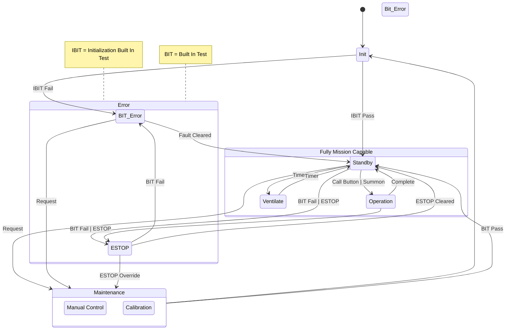

# Main State Machine

```mermaid
stateDiagram-v2
    classDef badBadEvent fill: Red, color:white,font-weight:bold,stroke-width:6px,stroke:Green

    classDef lessBadEvent fill: Red,color:white,font-weight:bold,stroke-width:6px,stroke:Green
    
    classDef NoMovement font-weight:bold, stroke-width:4px,stroke:Green

    classDef Movement font-weight:bold stroke-width:6px,stroke:Yellow

    state  "Fully Mission Capable" as FMC
    
    
    [*] --> Init
    Init --> BIT_Error : IBIT Fail
    Init --> Standby : IBIT Pass
    
    Standby --> Maintenance  : Request
    Standby --> ESTOP : BIT Fail | ESTOP
    Operation --> ESTOP : BIT Fail | ESTOP
    
    BIT_Error --> Standby : Fault Cleared
    BIT_Error --> Maintenance : Request
    
    
    ESTOP --> BIT_Error : BIT Fail
    ESTOP --> Standby : ESTOP Cleared
    ESTOP --> Maintenance : ESTOP Override
    
    Maintenance --> Init 
    Maintenance --> Standby : BIT Pass

    state FMC {
        Standby 
        Operation
        Ventilate

        Standby --> Operation : Call Button | Summon
        Operation --> Standby : Complete
        Standby --> Ventilate : Timer 
        Ventilate --> Standby : Timer 
        
    
    }
    
    state Maintenance {
        state "Manual Control" As M1
        state "Calibration" As M2
    }

    state Error {
        BIT_Error
        ESTOP
    }

    note left of Error : IBIT = Initialization Built In Test

    note left of Error : BIT = Built In Test

    Init ::: NoMovement

    Standby ::: NoMovement
    Operation ::: Movement

    Maintenance ::: Movement

    ESTOP ::: badBadEvent
    Bit_Error ::: lessBadEvent


```